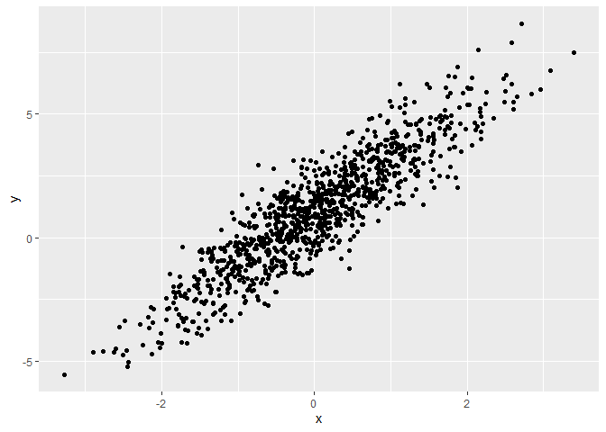
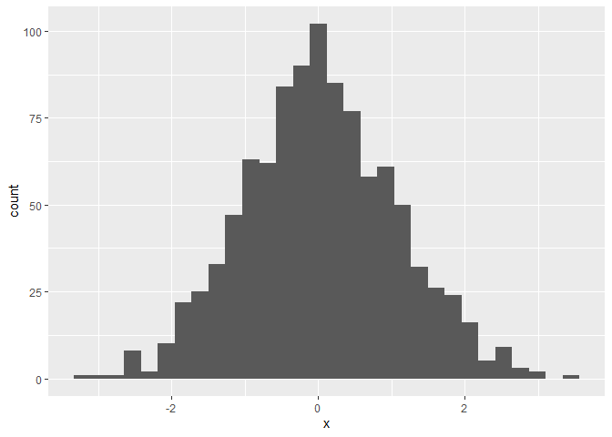
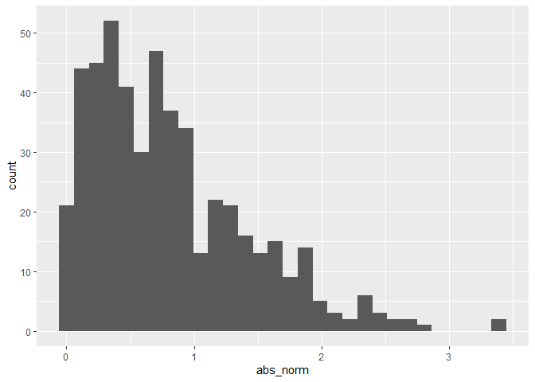

Session 3: R Markdown and Formatting
================

``` r
library(tidyverse)
```

    ## ── Attaching packages ─────────────────────────────────────── tidyverse 1.3.2 ──
    ## ✔ ggplot2 3.3.6      ✔ purrr   0.3.4 
    ## ✔ tibble  3.1.8      ✔ dplyr   1.0.10
    ## ✔ tidyr   1.2.1      ✔ stringr 1.4.1 
    ## ✔ readr   2.1.2      ✔ forcats 0.5.2 
    ## ── Conflicts ────────────────────────────────────────── tidyverse_conflicts() ──
    ## ✖ dplyr::filter() masks stats::filter()
    ## ✖ dplyr::lag()    masks stats::lag()

I’m an R Markdown document!

# Section 1

eval = FALSE: code will be displayed but not executed; results are not
included. echo = FALSE: code will be executed but not displayed; results
are included. include = FALSE: code won’t be executed or displayed.
message = FALSE and warning = FALSE: prevents messages and warnings from
being displayed. results = hide and fig.show = hide: prevents results
and figures from being shown, respectively. collapse = TRUE: output will
be collapsed into a single block at shown at the end of the chunk.
error: errors in code will stop rendering when FALSE; errors in code
will be printed in the doc when TRUE. The default is FALSE and you
should almost never change it.

Here’s a **code chunk** that samples from a *normal distribution*:

``` r
samp = rnorm(100)
length(samp)
```

    ## [1] 100

# Section 2

I can take the mean of the sample, too! The mean is 0.038701.
`round(mean(samp), 2)`

# Section 3

This is going to make a plot! First I generate a dataframe, then use
`ggplot` to make a scatterplot and nameming a code chunk!

``` r
plot_df = 
  tibble(
    x = rnorm(n = 1000),
    y = 1 + 2 * x + rnorm(n = 1000)
  )

ggplot(plot_df, aes(x = x, y = y)) + geom_point()
```

<!-- -->

``` r
ggplot(plot_df, aes(x = x)) + geom_histogram()
```

    ## `stat_bin()` using `bins = 30`. Pick better value with `binwidth`.

<!-- -->

# Section 4

This creates a dataframe comprised of: a numeric variable containing a
random sample of size 500 from a normal variable with mean 1; a logical
vector indicating whether each sampled value is greater than zero; and a
numeric vector containing the absolute value of each element. Then,
produce a histogram of the absolute value variable just created. Add an
inline summary giving the median value rounded to two decimal places.
What happens if you set eval = FALSE to the code chunk? What about echo
= FALSE?

``` r
la_df = 
  tibble(
    norm = rnorm(n = 500), mean = 1,
    logical = norm > 0,
    abs_norm = abs(norm)
  )

ggplot(la_df, aes(abs_norm)) + geom_histogram()
```

    ## `stat_bin()` using `bins = 30`. Pick better value with `binwidth`.

<!-- -->

## Section 4a

eval = FALSE: code will be displayed but not executed; results are not
included. echo = FALSE: code will be executed but not displayed; results
are included.

Here’s a list:

-   List item 1
-   List item 2
